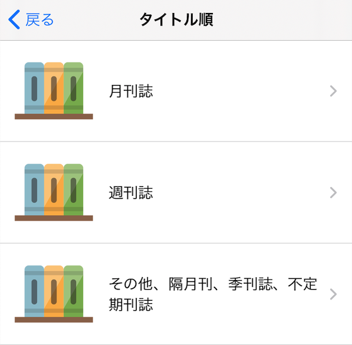

## 画像のサンプル

# 目次

- <a href="#content1" name="toc1">サピエ図書館</a>
  - <a href="#content1_1" name="toc1_1">図書検索</a>
    - <a href="#content1_1_1" name="toc1_1_1">デイジー新着情報</a>
    - <a href="#content1_1_2" name="toc1_1_2">人気のある順</a>
    - <a href="#content1_1_3" name="toc1_1_3">分類別</a>
    - <a href="#content1_1_4" name="toc1_1_4">前回の検索結果一覧</a>
    - <a href="#content1_1_5" name="toc1_1_5">タイトル著者名検索</a>
  - <a href="#content1_2" name="toc1_2">定期配信の新着</a>
  - <a href="#content1_3" name="toc1_3">雑誌検索</a>
    - <a href="#content1_3_1" name="toc1_3_1">新着順</a>
    - <a href="#content1_3_2" name="toc1_3_2">タイトル順</a>
    - <a href="#content1_3_3" name="toc1_3_3">タイトル検索</a>
    - <a href="#content1_3_4" name="toc1_3_4">定期配信の登録</a>
    - <a href="#content1_3_5" name="toc1_3_5">定期配信の解除</a>

  - <a href="#content1_4" name="toc1_4">サピエIDとパスワード</a>
- <a href="#content2" name="toc2">ダウンロード図書</a>
  - <a href="#content2_1" name="toc2_1">図書を再生する</a>
  - <a href="#content2_2" name="toc2_2">図書を並び替える</a>
  - <a href="#content2_3" name="toc2_3">図書を削除する</a>
- <a href="#content3" name="toc3">Dropbox</a>
- <a href="#content4" name="toc4">設定</a>
  - <a href="#content4_1" name="toc4_1">バックグラウンド再生</a>
  - <a href="#content4_2" name="toc4_2">Dropboxと連携</a>
  - <a href="#content4_3" name="toc4_3">バージョン情報</a>

# サピエ図書館

<a href="#toc1">目次に戻る</a>

サピエ図書館の図書を探せます。「図書検索」「定期配信の新着」「雑誌検索」「サピエIDとパスワード」があります。

## 図書検索

様々な種類の図書を検索できます。

「デイジー新着情報」「人気のある順」「分類別」「前回の検索結果一覧」「タイトル 著者名 検索」があります。

### デイジー新着情報

あたらしい図書を探せます。
期間は「過去1週間」と「過去1ヶ月」から選べます。

### 人気のある順

人気のある図書を探せます。

### 分類別
分類別に図書を探せます。
興味のあるジャンルの図書を一覧したいときに便利です。

### 前回の検索結果一覧

直前の検索結果を表示できます。

### タイトル著者名検索

タイトル、著者名、キーワードから図書を検索できます。

音声入力も可能です。

検索履歴からの入力ができます。

一度、検索した条件で再検索したいときに便利です。

検索履歴は20件まで保存されています。

20件を超えると、古い履歴から削除しています。

## 定期配信の新着

雑誌検索から定期配信に登録した雑誌を一覧します。
最初はなにも登録されていないためなにも表示されません。

## 雑誌検索
雑誌検索ができます。
雑誌は、定期的に更新される図書のことを指し、定期配信を登録しておくことで新刊が出たときに自動で雑誌の一覧が更新されます。

### 新着順

雑誌の新着を一覧します。

### タイトル順

### タイトル検索

### 定期配信の登録

「月刊誌」「週刊誌」「その他、隔月刊、季刊誌、不定期刊誌」から選べます。

## サピエIDとパスワード
サピエ図書館にログインするためのIDとパスワードをこの画面で入力します。
ログインが完了すると、図書検索ページに移動します。

# ダウンロード図書

<a href="#toc2">目次に戻る</a>

# Dropbox

<a href="#toc3">目次に戻る</a>

# 設定

<a href="#toc4">目次に戻る</a>

## バックグラウンド再生

デイジー再生中に、アプリを切り替えたりスリープしても再生を続ける設定です。
ONにすることで、有効になります。

## Dropboxと連携

Dropboxと連携して、クラウドストレージに保存したデイジー図書を楽しむことができます。
機能を利用するには、Dropboxのアカウントが必要です。

## バージョン情報

アプリのバージョンを確認できます。
